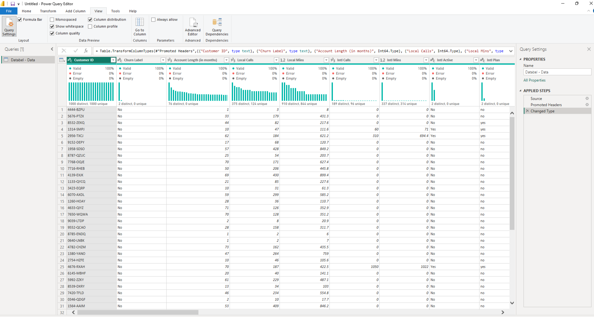

# Customer-Churn-Analysis
### This is a detailed report dissecting why customers churn in Databel - a fictional telecommunications company using Power Query, Power BI and DAX. This dataset was obtained from Datacamp.

## Importance of Analysing Churn Rate
The following are reasons why analysing churn rate is very important for any company:

1. High Churn Rate can reflect poor competiveness
2. Churn rate tracks customer retention
3. Reducing churn is a key business goal as it can influence profit maximisation
   
## Project Outline
1. Prepare the Data
2. Explore the Data
3. Analyse & Visualise
4. Dashboarding

## Prepare the Data

Before analysing the data, it has to be cleaned and structed in order to make sure we derive accurate results.  The dataset was obtained from Datacamp and uploaded on Power Query. There was an option to load the data directly into Power BI but I chose to transform the data first. The following are things I did to prepare the data:

- Remove Duplicates
There should be at most one customer per row. Multiple rows of the same customer would negatively affect the analysis
- Remove Errors
Wrong Inputs were either rectified or deleted
- Remove redundant columns
It is a large dataset with several columns. some of these columns were removed because they have no use in this project and it improves the performance of the report
- Make sure all columns have the correct data types

### Transforming the dataset 

### Now that the data has been prepared, it was time to save the changes made and explore the data!

Despite completing the preparation process, I still wanted to make sure the number of customers were unique. There should only be one distinct customer per row. To do this, I created a measure to calculate the distinct number of customers to compare with another measure that counts the number of customers. i.e Number of Unique Customers = DISTINCTCOUNT('Databel - Data'[Customer ID]). Fortunately, both measures were exactly the same so I was good to go!

##Calculating Churn Rate

Using the "Churn Label" column - which is a column that states whether a customer has churned or not, I was able to calculate the total churn rate. The "Churn Label" is a boolean attribute, hence it has only two values - Yes or No. To calculate the churn rate, I created a custom column called "Churned" which was populated by 1 and 0. 1 represents "Yes" from the "Churn Label" column and 0 represents "No". 
With this DAX formula, I was able to get the total churn rate i.e
   # Churn Rate = Number of Churned Customers / Number of Customers

According to the calculation, the churn rate is **26.86%**. In other words, For every 100 customers, 27 customers churn. 
## *Is that great? NO, but is it terrible? Well, let's explore the data further to know why customers are churning*

### Whilst 27% might not look like much, that is nearly a third of Databel's customers churning. In that context, it looks bad. so why are the customers churning?

## Reasons Why Customers Churn

The next point of focus is the reasosn why customer churn. In the Dataset, there is a column named "Churn Reason" that consists of the the reasons why customers have churned. To graphically show these reasons, I plotted a clustered bar chart of the Churn Reasons against the corresponding percentage of the total number of churned customers.
According to the chart, The top 5 Churn Reasons are:

### 1. Competitor made a better offer 
### 2. Competitor had better devices
### 3. Attitude of support person
### 4. Competitor offered more data
### 5. Competitor offered higher download speed

In Summary, Databel lost customers mostly due to their competitors having superior value proposition. They offer better and more attractive services to customers. Another major churn reason is the inadequate attitude of support employees. Customers feel discouraged to use Databel's support services because of how badly they have been treated while contacting the support team.

### Churn Reasons 

