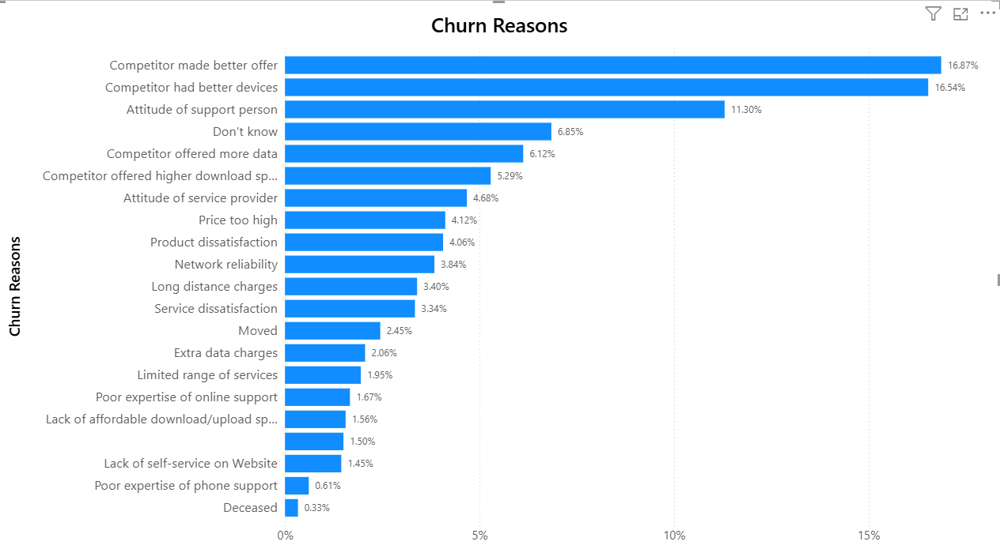
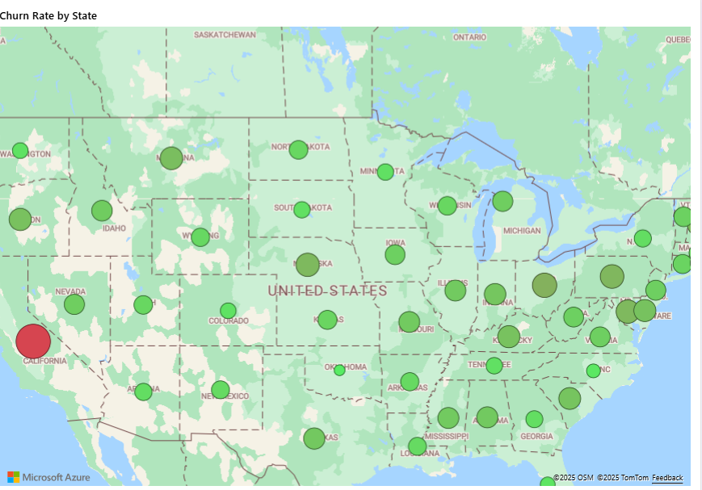
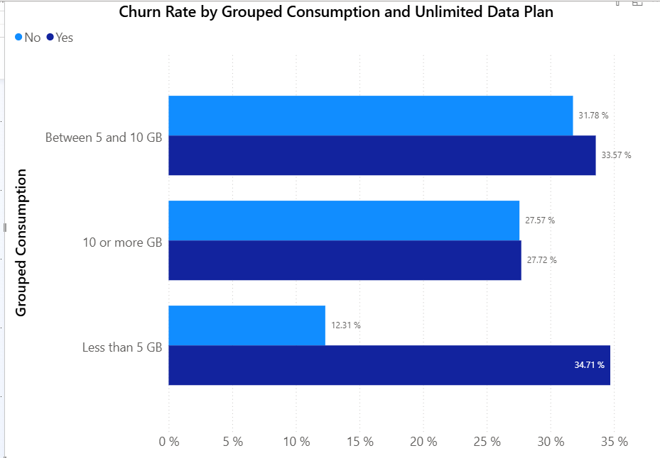
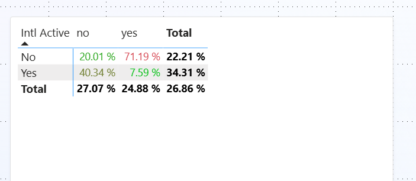
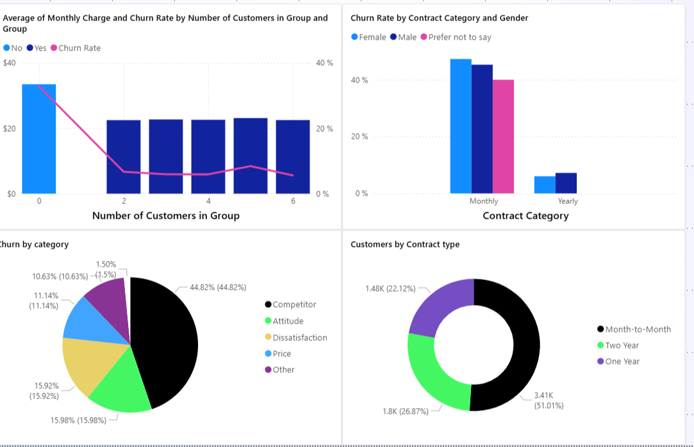
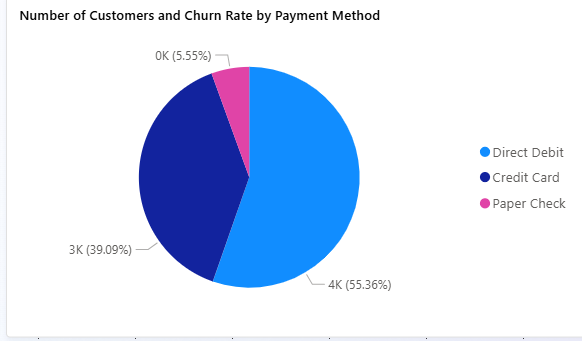
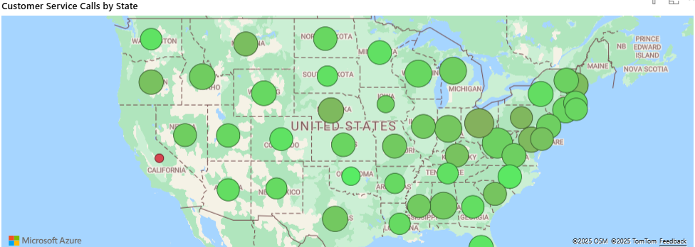

# Customer-Churn-Analysis
### This is a detailed report dissecting why customers churn in Databel - a fictional telecommunications company using Power Query, Power BI and DAX. This dataset was obtained from Datacamp.

## Importance of Analysing Churn Rate
The following are reasons why analysing churn rate is very important for any company:

1. High Churn Rate can reflect poor competiveness
2. Churn rate tracks customer retention
3. Reducing churn is a key business goal as it can influence profit maximisation
   
## Project Outline
1. Prepare the Data
2. Explore the Data
3. Analyse & Visualise
4. Dashboarding

## Prepare the Data

Before analysing the data, it has to be cleaned and structed in order to make sure we derive accurate results.  The dataset was obtained from Datacamp and uploaded on Power Query. There was an option to load the data directly into Power BI but I chose to transform the data first. The following are things I did to prepare the data:

- Remove Duplicates:
There should be at most one customer per row. Multiple rows of the same customer would negatively affect the analysis
- Remove Errors:
Wrong Inputs were either rectified or deleted
- Remove redundant columns:
It is a large dataset with several columns. some of these columns were removed because they have no use in this project and it improves the performance of the report
- Make sure all columns have the correct data types

### Now that the data has been prepared, it was time to save the changes made and explore the data!

Despite completing the preparation process, I still wanted to make sure the number of customers were unique. There should only be one distinct customer per row. To do this, I created a measure to calculate the distinct number of customers to compare with another measure that counts the number of customers. i.e Number of Unique Customers = DISTINCTCOUNT('Databel - Data'[Customer ID]). Fortunately, both measures were exactly the same so I was good to go!

## Churn Demographics page
The first page of the report is the Churn Dempographics page.

### Calculating Churn Rate

Using the "Churn Label" column - which is a column that states whether a customer has churned or not, I was able to calculate the total churn rate. The "Churn Label" is a boolean attribute, hence it has only two values - Yes or No. To calculate the churn rate, I created a custom column called "Churned" which was populated by 1 and 0. 1 represents "Yes" from the "Churn Label" column and 0 represents "No". 
With this DAX formula, I was able to get the total churn rate i.e
   ### Churn Rate = Number of Churned Customers / Number of Customers

According to the calculation, the churn rate is **26.86%**. In other words, For every 100 customers, 27 customers churn. *Is that great? NO, but is it terrible? Well, let's explore the data further to know why customers are churning*. Whilst 27% might not look like much, that is nearly a third of Databel's customers churning. In that context, it looks bad. so why are the customers churning?

### Reasons Why Customers Churn

The next point of focus is the reasosn why customer churn. In the Dataset, there is a column named "Churn Reason" that consists of the the reasons why customers have churned. To graphically show these reasons, I plotted a clustered bar chart of the Churn Reasons against the corresponding percentage of the total number of churned customers.
According to the chart, The top 5 Churn Reasons are:

1. Competitor made a better offer 
2. Competitor had better devices
3. Attitude of support personnel
4. Competitor offered more data
5. Competitor offered higher download speed

In Summary, Databel lost customers mostly due to their competitors having superior value proposition. They offer better and more attractive services to customers. Another major churn reason is the inadequate attitude of support employees. Customers feel discouraged to use Databel's support services because of how badly they have been treated while contacting the support team.

### Churn Rate Nationwide

Databel has approximately 7000 customers living in different parts of the world with most of them living in the United States. Location could be a factor that influences Churn Rate so the aim of the following chart is to display Churn rates by the different states in the United States in a map chart. The bubble sizes represent the size of churned customers in each state. Different shades of green represent low churn rate and red represents churn rates of above 50%.  According to the map chart, the state of California has the highest churn rate of 63%.

## Customers by Age and Churn Rate

In order to display the trend(if any) betweem Customers, Age and the churn rate. Firstly, the ages are grouped into bins with intervals of 5 before being added to the chart. Overall, the chart shows a positive correlation between the Age of the customer nad the churn rate. This means that the older the customer, the higher the churn rate. This trend is displayed from Age 15 to 70.

### Unlimited Plan

Databel has a hypothesis that people who are not on an unlimited data plan are more likely to churn. To investigate this hypothesis, the average GB download for each customer was grouped into 3 categories - less than 5GB, between 5 and 10 GB and more than 10 GB. This helps to discover a trend not only between Churn rate and Unlimited Plan but also the average GB download per customer. According to the chart, customers with unlimted plan in each of the categories have a higher churn rate than those who do not have an unlimited data plan. Hence, disproving Databel's hypothesis.

### International Calls

The analysis requirement given by Databel includes a request to analyze the international activity of customers and its relationship to churn. They are curious about the behavior of customers who call internationally, and if paying for an international plan influences their loyalty. After creating a table to see if there is a relatioonship between international activity, international plan and churn rate, the churn rate was the highest with customers who pay for an international plan but they hardly use it - An alarming 71%. A quick solution to this problem will be to contact these customers and suggest that they downgrade their plans.

### Groups and Categories

Databel offers group contracts to customers from the same household. The advantage for the customer is a discounted rate, while it's a great way for Databel to grow its customer base. In this section of the report, the correlation between categories such as Contract Type ( Monthly, Annually , Bienally), Churn Category,  Gender and Churn Rate was explored. The churn rate for month-to-month contracts is at 46% and 11% for annual contracts. The Churn Category column is made up of the grouped churn reasons discussed earlier in the report. According to the charts, Most of the company's customers have month-to-month contracts. Also, the most common churn category is Competitor, 45% of Databel's churned customers churned because of Databel's competitors. Another interesting point is that the churn rate is slightly higher for female customers that have a month-to-month contract than it is for male customers. On the contrary, reverse is the case on annual contracts as churn rate is higher for male customers.

Databel also wants to improve its customer service since there have been some reported issues. The next step was to explore customer-related columns such as payment method, account length and contract type, and how they affect churn rate. From the chart that shows the churn rate by account length, It can be observed that there is a negative correlation between the two axes. The longer the customer's account has existed, the lesser the churn rate. In another chart that displays the different payment methods and their churn rates, Direct Debit is the most commonly used payment by customer, with over half of the customers using this method. However, the churn rate for this payment isn't the highest. Rather, customers who use Paper Check have the highest churn rate (38%)

### Customer Service Calls

In another attempt to tackle the customer service problem, I sought to discover any correlation between the states with the highest churn rates and the number of customer service calls coming from that state. According to the map chart, not omly does California have the highest churn rate as discussed earlier in this report, it also has the lowest number of customer service calls (44).

